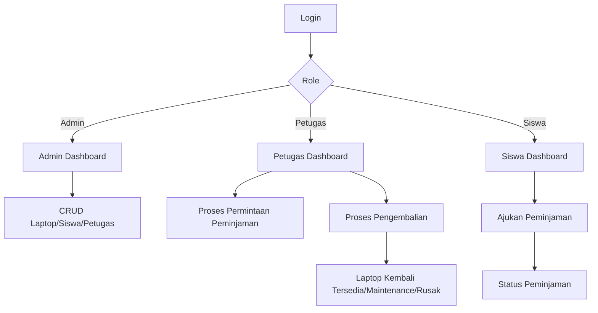

# APLIKASI PEMINJAMAN LAPTOP SEKOLAH

## Deskripsi

Aplikasi ini adalah frontend prototype sistem peminjaman laptop sekolah yang dibuat dengan HTML5, Tailwind CSS via CDN, JavaScript vanilla, Lucide Icons, dan LocalStorage. Tujuannya adalah memberikan simulasi aplikasi yang bisa dibuka langsung di browser tanpa backend.

## Fitur

- Login multi-role: Admin, Petugas, dan Siswa
- Dashboard per role
- CRUD data laptop, siswa, petugas, dan user
- Proses peminjaman dan pengembalian
- Search, filter, dan tabel responsif
- Mobile drawer untuk sidebar
- LocalStorage untuk simulasi database
- Toast notification dan modal

## Role

### Admin

- Dashboard
- Data Siswa
- Data Petugas
- Data User
- Data Laptop
- Gambar Laptop
- Data Peminjaman
- Data Pengembalian
- Laporan
- Pengaturan

### Petugas

- Dashboard
- Data Laptop
- Permintaan Peminjaman
- Pengembalian
- Peminjaman Aktif
- Riwayat

### Siswa

- Dashboard
- Laptop
- Ajukan Peminjaman
- Status Peminjaman
- Peminjaman Aktif
- Riwayat

## Teknologi

- HTML5
- Tailwind CSS via CDN
- Vanilla JavaScript
- Lucide Icons
- LocalStorage

## Struktur Folder

```text
peminjaman-laptop/
├── index.html
├── README.md
├── .gitignore
├── admin/
│   ├── dashboard.html
│   ├── siswa.html
│   ├── petugas.html
│   ├── users.html
│   ├── laptop.html
│   ├── peminjaman.html
│   ├── pengembalian.html
│   ├── laporan.html
│   └── pengaturan.html
├── petugas/
│   ├── dashboard.html
│   ├── laptop.html
│   ├── peminjaman.html
│   ├── pengembalian.html
│   ├── aktif.html
│   └── riwayat.html
├── siswa/
│   ├── dashboard.html
│   ├── laptop.html
│   ├── peminjaman.html
│   ├── status.html
│   └── riwayat.html
├── assets/
│   ├── css/
│   │   └── style.css
│   └── js/
│       ├── app.js
│       ├── auth.js
│       ├── data.js
│       └── components.js
└── .gitignore
```

## Cara Menjalankan

1. Unduh atau clone project.
2. Buka folder project di browser.
3. Jalankan file `index.html` secara langsung.
4. Login menggunakan akun demo di bawah ini.

## Akun Demo

- Admin: `admin / admin123`
- Petugas: `petugas / petugas123`
- Siswa: `siswa / siswa123`

## Business Logic

### Peminjaman

- Siswa memilih laptop dan mengisi form.
- Sistem menyimpan data peminjaman dengan status `Menunggu`.
- Petugas dapat menyetujui atau menolak.
- Jika disetujui, laptop berubah status menjadi `Dipinjam`.
- Jika ditolak, laptop tetap `Tersedia`.

### Pengembalian

- Siswa mengajukan pengembalian.
- Petugas memeriksa kondisi laptop.
- Jika kondisi baik, status peminjaman menjadi `Dikembalikan` dan laptop `Tersedia`.
- Jika kondisi rusak atau perlu maintenance, laptop berubah menjadi `Maintenance` atau `Rusak`.

## Flowchart



## ERD dan User Flow


## Catatan Prototype

- Frontend prototype ini menggunakan LocalStorage sebagai simulasi database.
- Data bersifat lokal dan hanya untuk demonstrasi.
- Bukan autentikasi production.
- Semua flow kerja bisa dicoba di browser tanpa backend.

## Pengembangan Selanjutnya

- Menambahkan export laporan ke PDF/Excel
- Menyambungkan ke API nyata
- Menambahkan validasi lebih lengkap
- Integrasi autentikasi backend
- Menambahkan notifikasi real-time

## Catatan Penting

Aplikasi ini dibuat untuk demonstrasi frontend dan tidak menggunakan PHP, MySQL, Laravel, Node.js, React, Vue, Angular, Bootstrap, atau framework lain.
